# Project Dug
> "Squirrel!" - Dug the Dog

> "Hey, I know a joke! A squirrel walks up to a tree and says, 'I forgot to store acorns for the winter and now I am dead.' Ha! It is funny because the squirrel gets dead!" - Also Dug the Dog

> Russell: Can we keep him, please?
> Carl Fredricksen: No.
> Russell: But it's a TALKING DOG!


Project Dug is an exploratory effort to extract actionable signal from a custom electroencephalogram (EEG) cap being built for a dog named Alma. We validate whether our captured signal is actionable by classifying whether Alma sees a treat ("Squirrel!") just using her neural response!

[](https://youtu.be/UpLDRoqXFys)
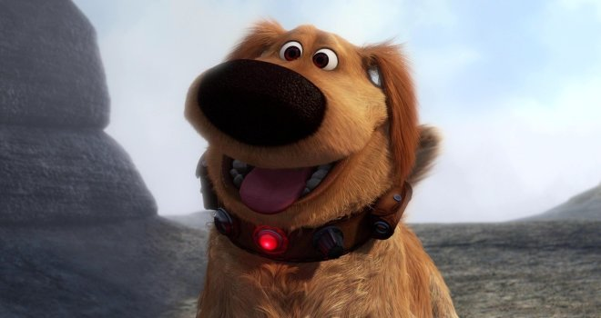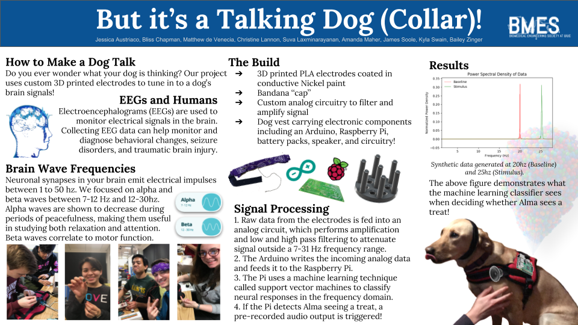
------------

## Team
- Jessica Austriaco, Bioengineering 2019, Team Lead
- Bliss Chapman, Statistics + Computer Science 2019, Signal Processing Lead
- Matthew De Venecia, Bioengineering 2019, Hardware Lead
- Amanda Maher, Mechanical Engineering 2020, Electrode + Materials + Cap Lead
- Suva Laxminarayanan, Bioengineering 2022
- Christine Lannon, Bioengineering 2019
- James Soole, Bioengineering 2022
- Kyla Swain, Bioengineering 2019

## Technical Details
Electrodes are 3D-printed out of PLA and painted with a Nickel conductive coating.

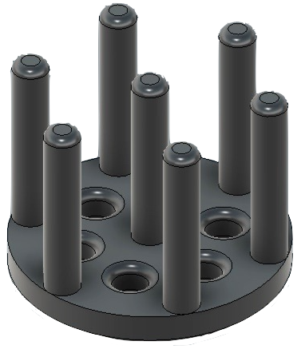 + =  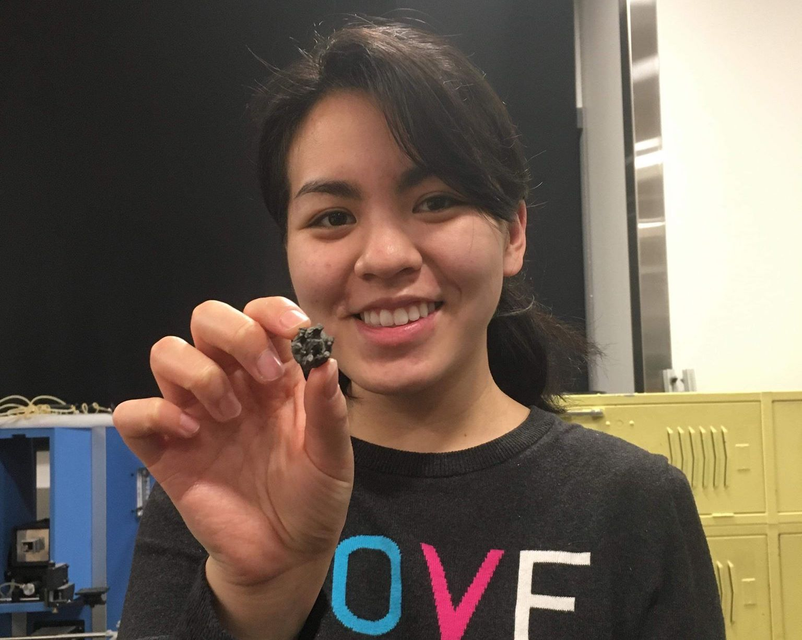

Wires are connected to the electrodes by feeding an exposed end through the holes in the electrode base plate and the connection is solidified with conductive paint.

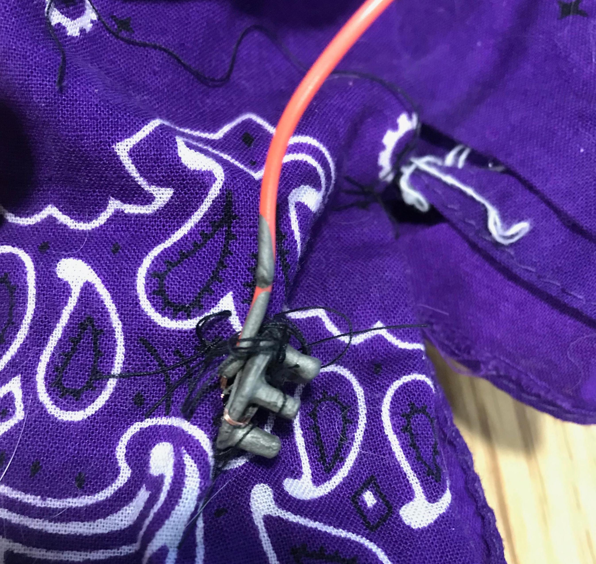

Two 3D printed electrodes are sewn into a headband and an elastic chin strap is connected to each end to keep the electrodes tightly pressed into Alma's scalp. One electrode is used as a ground measurement and is attached to Alma's ear. The wires are braided and coated in Nickel conductive paint to reduce electrical interference from other circuits as well as muscle activity.

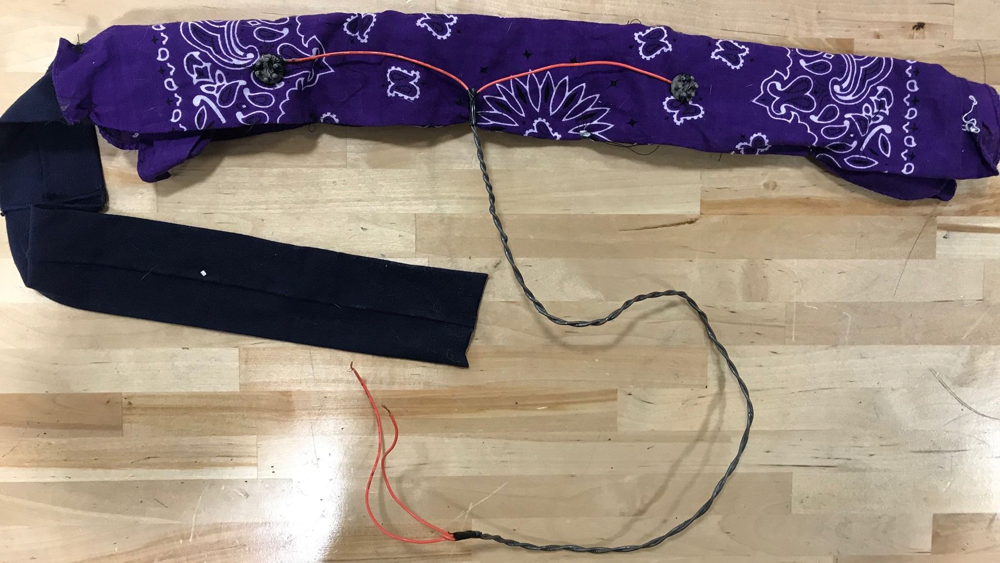

Wires are run down Alma's back into an analog circuit that is mounted on Alma's harness. The analog circuit performs low and high pass filtering on the signal, attenuating signals with a frequency less than 7 hz and greater than 31 hz. The analog circuit also amplifies the signal with a gain of about 89.2 when using a 560 ohm resistor.


Analog Circuit v1 and v2:

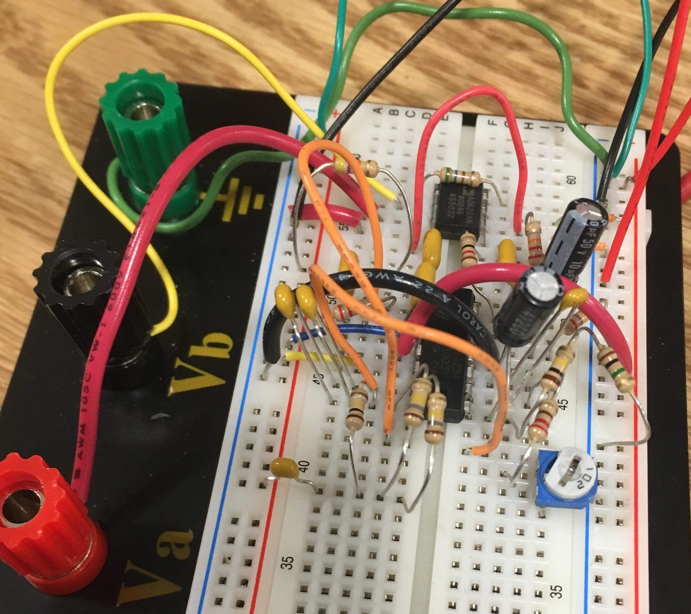 + 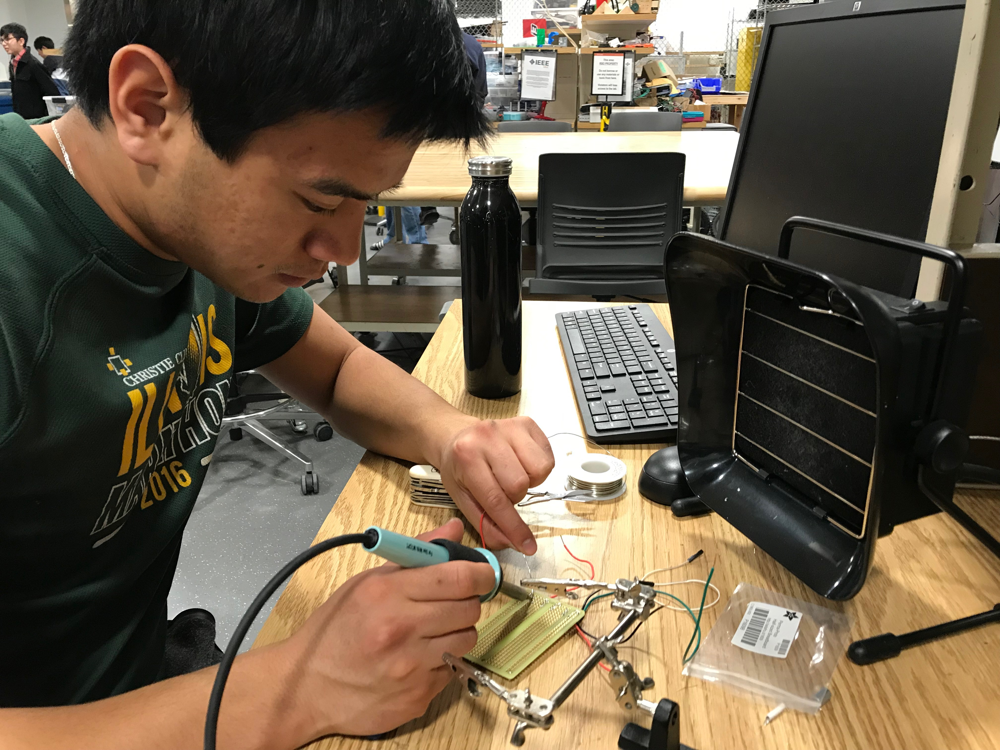 -> 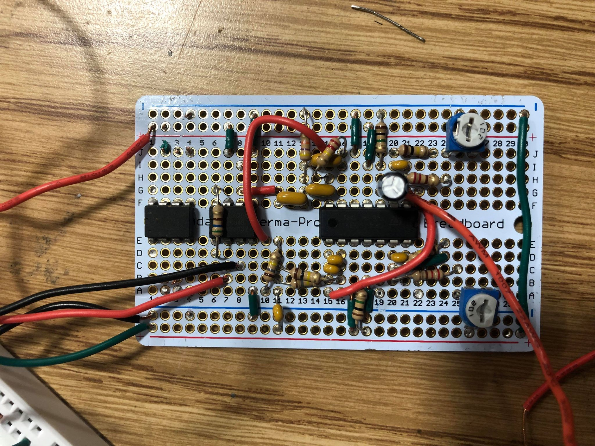

The Arduino (Mega 2560) reads in the data from an analog pin and immediately writes the data to the serial port. The serial port of the Arduino is connected to the serial port of a Raspberry Pi (RPI 3 Model B).

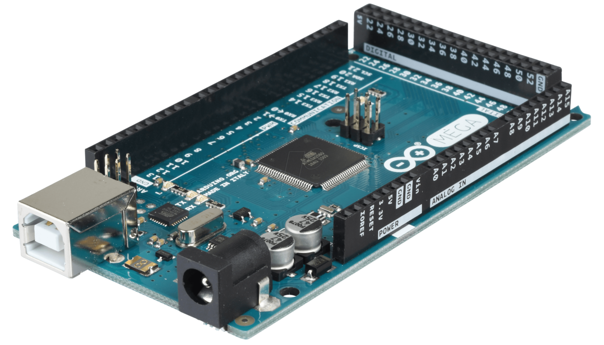

The Raspberry Pi reads data from the Arduino in through the serial port and performs machine learning classification on the fourier transform of a sliding window of data.

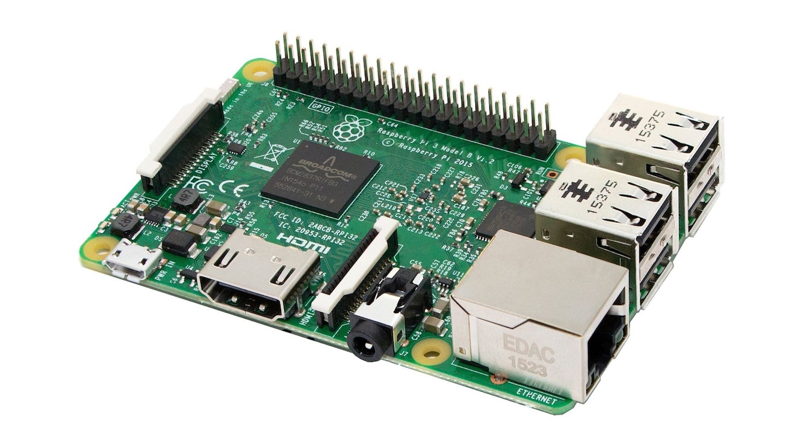

Fourier Transform visual illustrations:

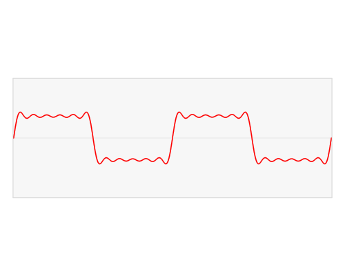 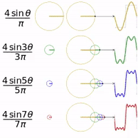 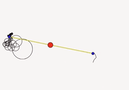

We are applying support vector machines in the frequency domain of our data to attempt to classify whether Alma is seeing a treat or not. Support vector machines (SVMs) are a supervised classification method that attempts to find a hyperplane that best divides our dataset into two classes. In our problem, the two classes are: (1) Alma does not see a treat and (2) Alma sees a treat.

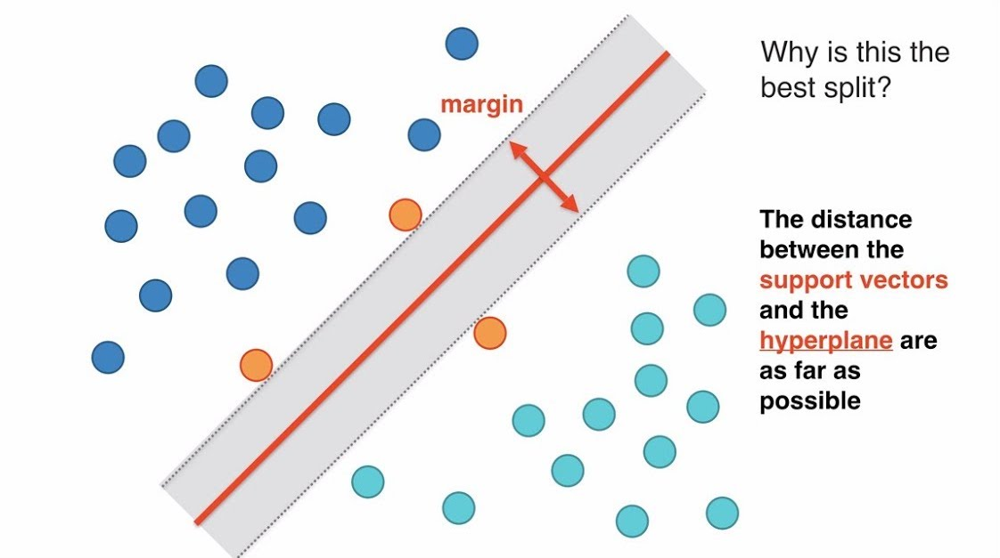 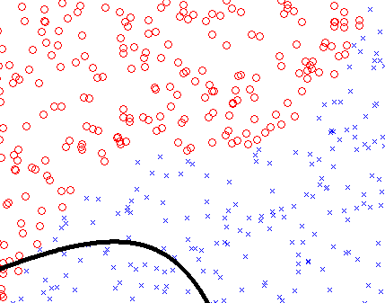

The Raspberry Pi is powered by a battery pack. The instrumentation amplifier in the analog circuit is powered by two 9V batteries.

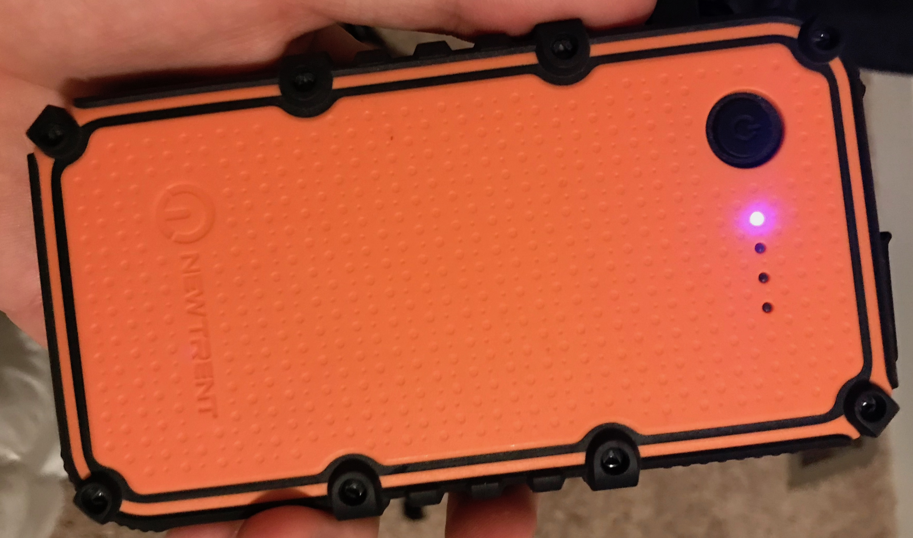 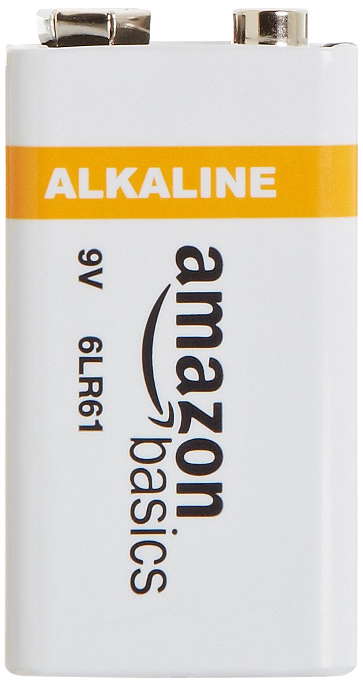 

If the machine learning algorithm classifies Alma's neural response as "Treat," then the Raspberry Pi triggers a pre-recorded Alma voice to play out of the speaker.

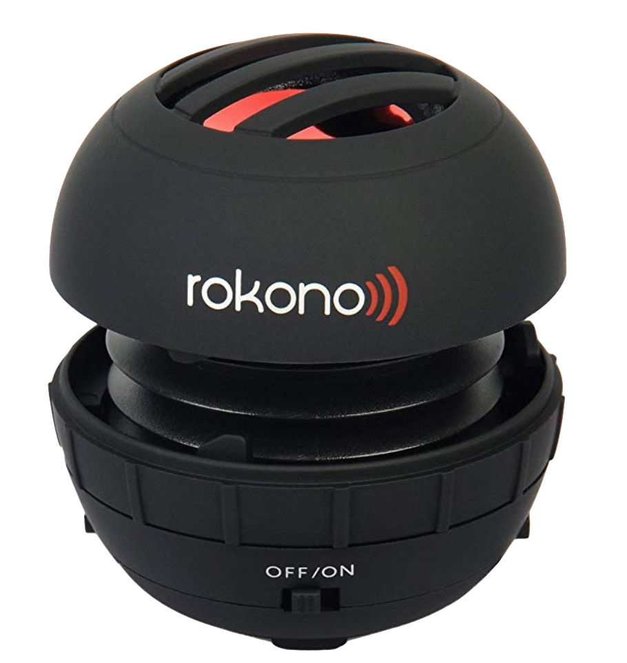

------------
## Dug Team Internal Documentation
#### Example Problem: Grasp and Lift EEG Detection
We were not able to start training or analyzing models on real data from Alma until after electrodes had been built and iterated. In the meantime, the signal processing team found toy problems to explore to familiarize ourselves with analysis and classification techniques for EEG data. Code for these problems lives in the `toy_problems` directory.

1. Download the data from the [Kaggle competition page](https://www.kaggle.com/c/grasp-and-lift-eeg-detection/data).
2. Move the downloaded `train` and `test` folders to `examples/grasp_and_lift/data/train` and `examples/grasp_and_lift/data/test` respectively.
3. Install any required packages (sorry, I haven't added a requirements.txt file yet).
4. In your terminal, run:
```
cd examples/grasp_and_lift
python2 -W ignore model_exploration.py
```

#### Raspberry Pi
- [Download Raspbian Stretch Lite Image](https://www.raspberrypi.org/downloads/raspbian/)
- [Installing New Image](https://www.raspberrypi.org/documentation/installation/installing-images/mac.md)
- [Setting up a Raspberry Pi headless](https://www.raspberrypi.org/documentation/configuration/wireless/headless.md)
- Establishing an SSH Connection:
```
arp -na | grep -i b8:27:eb    # Scan for RPI on the network
ssh pi@xx.x.x.xx              # Password is 'raspberry'
```

- [Setup WiFi](https://www.raspberrypi.org/documentation/configuration/wireless/wireless-cli.md)
- [Raspberry Pi Status LEDs Explained](https://www.raspberrypi-spy.co.uk/2013/02/raspberry-pi-status-leds-explained/)

Changing Python Versions in Conda:
```
conda activate py27
```

#### References
* [Analysis and Classification of EEG Signals](https://eprints.usq.edu.au/23460/1/Siuly_2012_whole.pdf)
* [Automatic Artifact Removal from Electroencephalogram Data Based on A Priori Artifact Information](https://www.hindawi.com/journals/bmri/2015/720450/)
* [A high-speed brain-computer interface (BCI) using dry EEG electrodes](https://journals.plos.org/plosone/article?id=10.1371/journal.pone.0172400)
* [A wearable UHF RFID-based EEG system](https://ieeexplore.ieee.org/document/6548128)
* [Brainwave Classification of Visual Stimuli Based on Low Cost EEG Spectrogram Using DenseNet](https://www.sciencedirect.com/science/article/pii/S1877050918314467)
* [Single Channel EEG Brain Computer Interface](https://people.ece.cornell.edu/land/courses/ece4760/FinalProjects/s2012/cwm55/cwm55_mj294/index.html)
* [Canis familiaris as a model for non-invasive comparative neuroscience](http://etologia.elte.hu/file/publikaciok/2017/Bunford%202017%20-%20Canis%20familiaris%20as%20a%20model%20for%20non-invasive%20compa%20neurosci_web.pdf)
* [Carbon nanofiber-filled conductive silicone elastomers as soft, dry bioelectronic interfaces](https://journals.plos.org/plosone/article?id=10.1371/journal.pone.0189415)
* [Classifying EEG Signals in Response to Visual Stimulus](http://www.freepatentsonline.com/20160051163.pdf)
* [DIY EEG](https://www.instructables.com/id/DIY-EEG-and-ECG-Circuit/)
* [EEG Basics](https://www.youtube.com/playlist?list=PLxaiR6teSdjoEZWaDWm28A9QjFN7eguAp)
* [EEG-based Target Detection During a multi-Rapid Serial Visual Presentation](https://ieeexplore-ieee-org.proxy2.library.illinois.edu/stamp/stamp.jsp?tp=&arnumber=8008412)
* [Light-cured polymer electrodes for non-invasive EEG recordings](https://www.nature.com/articles/s41598-018-32304-6)
* [Multi-channel EEG recordings during 3,936 grasp and lift trials with varying weight and friction](www.nature.com/articles/sdata201447)
* [Reactivity of Dogs' Brain Oscillations to Visual Stimuli Measured with Non-Invasive Electroencephalography](https://www.ncbi.nlm.nih.gov/pmc/articles/PMC3641087/)
* [Signals and Systems, Fall 2011](https://www.youtube.com/playlist?list=PLUl4u3cNGP61kdPAOC7CzFjJZ8f1eMUxs)
* [Soft, Comfortable Polymer Dry Electrodes for High Quality ECG and EEG Recording](https://res.mdpi.com/sensors/sensors-14-23758/article_deploy/sensors-14-23758.pdf?filename=&attachment=1)
* [Soft, curved electrode systems capable of integration on the auricle as a persistent brain–computer interface](http://www.pnas.org/content/112/13/3920)
* [Spatiotemporal Linear Decoding of Brain State](https://ieeexplore.ieee.org/document/4408447)
* [xDAWN algorithm to enhance evoked potentials: application to brain-computer interface.](https://www.ncbi.nlm.nih.gov/pubmed/19174332)
* [3D printed dry EEG electrodes](https://www.ncbi.nlm.nih.gov/pmc/articles/PMC5087423/)


#### 1st Meeting Notes (1/3/2019)

***OBJECTIVE***

We are trying to classify EEG signals in response to a visual stimulus. This is a hard problem and we need to be realistic about what resources we have!

***CHALLENGES***

- Real-time: This means we can’t use techniques like kNN.  Inference has to be fast even if training is slow!
- Training set size: We won’t be able to get enough high quality samples from Alma to try and train a sophisticated neural network model. We are probably orders of magnitude away from the number of samples needed for these methods.

These are good challenges!  Since we won’t have a lot of data, we have to be clever and learn more about our data and the brain!

***FEATURE EXTRACTION***

Transform very high dimensional spatiotemporal data to lower dimensional data while preserving information that’s important to us!

Possible approaches:
- Use prior knowledge about the brain!
    - event-related potentials (ERPs): in target-detection tasks in humans, there is a robust and specific target-related response in parietal regions ~300-500ms post-stimulus known as the P300 wave. Maybe this also occurs in dogs?
- Use prior knowledge about our measuring tools!
- Automatic unsupervised processes like PCA

NOTE: Typically, we need to worry about overfitting and reducing our model's ability to generalize across subjects.  However, in our case we only need our model to work for Alma which alleviates some concern.

***TEAM STRUCTURE***
* Core Research!
  * Dive DEEP into the nitty gritty details of EEG data.
    * How do we validate the data from our custom-engineered cap is useful and there is signal?
    * What specific frequency bands are useful to us?
    * How does downsampling and baseline correction of EEG data work? When should we use it?  
    * What techniques are available for automatic artifact removal from EEG data?
      * [Automatic Artifact Removal from Electroencephalogram Data Based on A Priori Artifact Information](https://www.hindawi.com/journals/bmri/2015/720450/)
  * Literature exploration to understand what algorithms are appropriate for our classification task. Some suggestions:
    * [Analysis and Classification of EEG Signals](https://eprints.usq.edu.au/23460/1/Siuly_2012_whole.pdf)
    * [EEG Basics](https://www.youtube.com/playlist?list=PLxaiR6teSdjoEZWaDWm28A9QjFN7eguAp) (YouTube Playlist)
    * [EEG-based Target Detection During a multi-Rapid Serial Visual Presentation](https://ieeexplore-ieee-org.proxy2.library.illinois.edu/stamp/stamp.jsp?tp=&arnumber=8008412)
    * [Brainwave Classification of Visual Stimuli Based on Low Cost EEG Spectrogram Using DenseNet](https://www.sciencedirect.com/science/article/pii/S1877050918314467)
    * [Classifying EEG Signals in Response to Visual Stimulus](http://www.freepatentsonline.com/20160051163.pdf)
    * [xDAWN algorithm to enhance evoked potentials: application to brain-computer interface.](https://www.ncbi.nlm.nih.gov/pubmed/19174332)
    * [Spatiotemporal Linear Decoding of Brain State](https://ieeexplore.ieee.org/document/4408447)
* EEG Data Science / Algorithms
  * Implementation and evaluation of algorithms on real data - evaluation is hard!
  * Visualization and explanation of results to the rest of the team!
  * You will work on lots of toy problems!
* Software Engineering
  * Integration with the rest of the system!
    * How does data get from the cap into our algorithms?
    * How do our algorithms trigger recordings on the collar to play?
  * What performance criteria do we need to meet in order for the system to be real time?  How do we measure and evaluate that?
  * What classification performance do we need to meet in the real world compared to offline analysis?  How do we measure and evaluate that?

IMPORTANT: Every member of the team will work on all of these areas!  However, we have a lot of ground to cover and a lot to learn so we will need to work together and play off each other's strengths to make this all work! If you take on one of these areas, you will own it and push yourself to go as far as you can, constantly communicating results and ideas back to the rest of the group so we can feed off your work.

***MATERIALS***
* All required software is free to write / use
* Raspberry Pi to run the software (Bliss has a bucket of them we can use for free)
